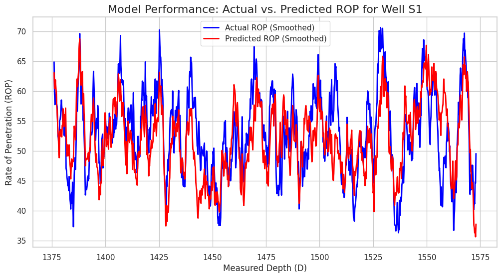

# 🤖 ROP Optimization - A Machine Learning Project

This repository contains a data science project for a university course. The goal is to build, train, and validate a machine learning model that can predict the Rate of Penetration (ROP) during well drilling.

## Project Goal

The main objective is to build a model that can predict **ROP** based on two sets of inputs:
1.  **Rock Properties** (from well logs like `GR`, `RHOB`, `NPHI`)
2.  **Driller's Actions** (controllable parameters like `Wt_on_bit`, `Surface_RPM`)

An accurate model like this is the first step toward building a recommendation system that can help a driller optimize their settings to drill faster and more efficiently.

## Our Approach: A 3-Step Workflow

We followed a complete data science workflow from data generation to validation.

### 1. Model Training
We combined all 27 well files into one large, clean master dataset. We then trained an **`XGBoost Regressor`** model on this data. This model learned the complex, non-linear relationship between all the inputs and the final ROP. The trained model is saved as `rop_model.joblib`.

### 2. Model Scoring (Prediction)
We used the trained model to make predictions on a new set of "test" wells. The script "scores" these test files and saves the new predictions as a `rop_avg_prediction` column.

### 3. Visualization & Validation
Finally, we compared the model's predictions against the "true" ROP values from our test set. We created comparison plots for each test well to visually confirm how well the model's predictions (red line) matched the actual ROP (blue line) versus depth.

*(Note: This path assumes you've saved your plots in this folder in your repo)*

## Key Technologies Used
* **Python 3**
* **Pandas & NumPy** (For all data cleaning and manipulation)
* **Scikit-learn** (For splitting data and measuring error)
* **XGBoost** (The core machine learning model)
* **Seaborn & Matplotlib** (For creating the final comparison plots)
